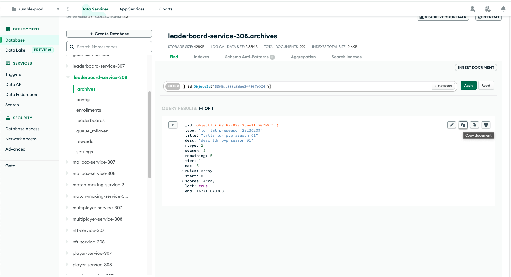
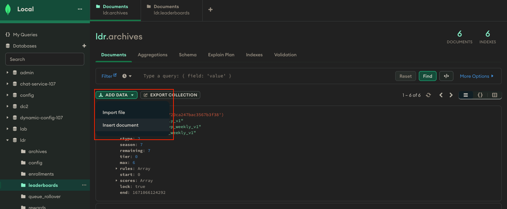
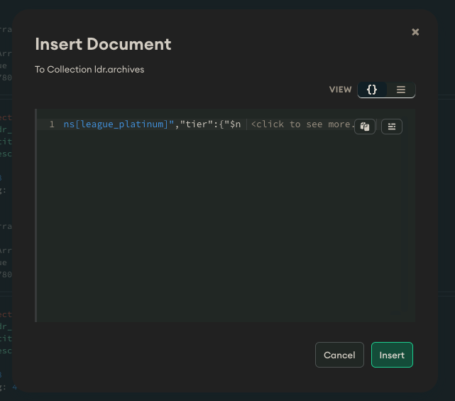

# Debugging Shard Rollover

Sometimes it's necessary to diagnose individual shard rollovers.  This can be a nuisance when you don't have access to real data, and reproducing reported issues can be really tough to do.  Luckily, when leaderboards rollover, the Archive Service stashes a complete copy of the shard we can work with.

Debugging real data requires some care, but this documentation will guide you through it.

**You must take every precaution to avoid adding data to the prod environment.  Do not, under any circumstances, have your local machine set to use the prod GITLAB_ENVIRONMENT_URL, prod mongo credentials, or anything else that could tie you to the active player data.**

## Requirements

* You have read access to MongoDB on the environment the problem was reported in.
* You have MongoDB set up locally.
* You have MongoDB Compass installed.
* You have Leaderboards `environment.json` configured correctly.

## Grabbing the Archive

In the leaderboards database, open the `archives` collection.  Here you'll find every recent shard that rolled over, along with ranking data and player scores.  Every entry has a full copy of its rules, so we only need to grab a single document.

Once you've filtered out the exact shard you want to debug, hover over the record.  Click the "copy" button to add it to you clipboard.



Open up MongoDB Compass and connect to your local Mongo database.  Open up your local `archives` collection and you'll see a button to `ADD DATA`.  You'll want the `Insert Document` option.



This will open up a popup where you can paste your clipboard archive in:



Finish the document creation with `Insert`.

## Debugging the Archive

Run the local Leaderboard Service.  You may wish to wait a few minutes; depending on how much you've worked with the service before, it may need to rollover your local leaderboards first.  Since you're going to put a breakpoint into rollover, you don't want a false break on a different shard or thread.

When you're ready, add a breakpoint to the beginning of `LeaderboardService.Rollover(Leaderboard)`.  This is the method and specific overload responsible for actually processing an individual leaderboard for rollover.

Next, make the following request:

```
POST /admin/debugRollover
{
    "archiveId": "{your archive shard ID}"
}
```

This endpoint copies the archive into your active leaderboards collection and starts the rollover process on it.  And, because the ID gets reset as part of this, you can use this as many times as you need.  Good luck!

**To reiterate, make sure you are not connected to prod during this.  If you are, the players can potentially receive their rewards again when rollover completes!**